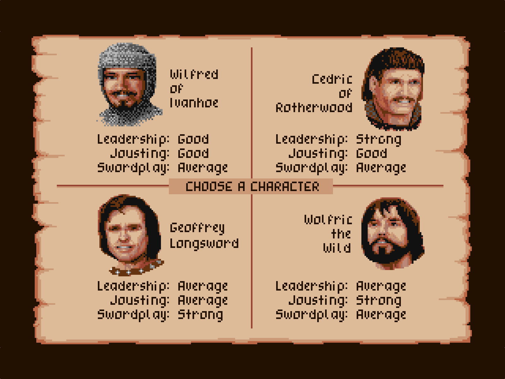

---
title: Amiga Pixel Aspect Ratios
redirect_from: "/sachs/"
redirect_from: "/par/"
--- 

The AmigaVision team cares deeply about preserving the correct aspect ratio for all games. That means going beyond just ensuring that games run in the correct variant of NTSC and PAL, but we also ensure that the Pixel Aspect Ratio (PAR) is correct. A pixel on the Amiga was close to square (16:15) in PAL resolutions on a CRT, but quite tall on NTSC displays (5:6). Most emulators and video captures seen online get this wrong and use 1:1 pixels instead, so we built an implementation that handles all the NTSC and PAL variants correctly on MiSTer.

Take a look at the difference using this screenshot from Defender of the Crown, which is an NTSC game. All the character portraits are squished vertically when rendered in PAL — making the characters look more stocky:

<figure class="compare before" id="dotc-compare">
  

    
    
  

  <figcaption class="compare-caption">NTSC</figcaption>
</figure>

In 2023, we completely reworked how this is handled, so you no longer have to manually switch to NTSC, which has tall pixels at 5:6 PAR, as demonstrated here in Defender of the Crown. 

All of these align to the 1080p/4K 16:9 pixel grid while having the correct Pixel Aspect Ratio, so you will not get any shimmering or non-integer pixels.

  
[John Novak on NTSC scaling]:https://blog.johnnovak.net/2022/04/15/achieving-period-correct-graphics-in-personal-computer-emulators-part-1-the-amiga/#pal-vs-ntsc